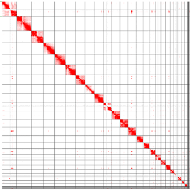
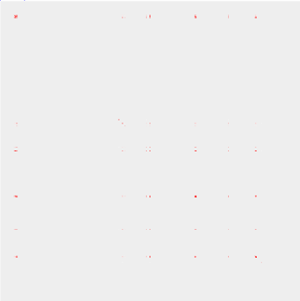
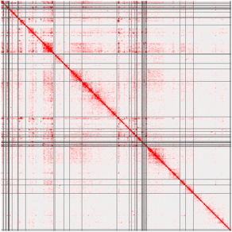
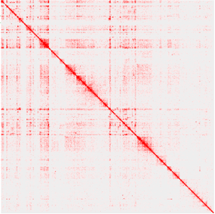

# **FreeMat**
## **this script is to get the a group of submatrix and refresh the chromosome id**

---------------------
## usage：

```
 bash Freemat/freemat.sh input_bam input_bed  out_name_prefix  init_chroms_size juicer_path 
```
## example：
> origin full matrix : <br>
 

> target regions : <br>


> pull the target regions together: <br>
> merged_with_gridlines: <br>


> merged_without_gridlines: <br>

